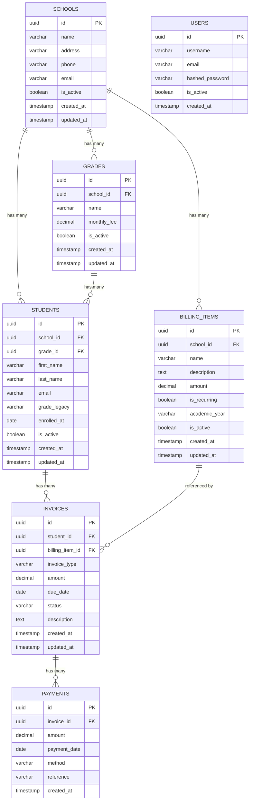
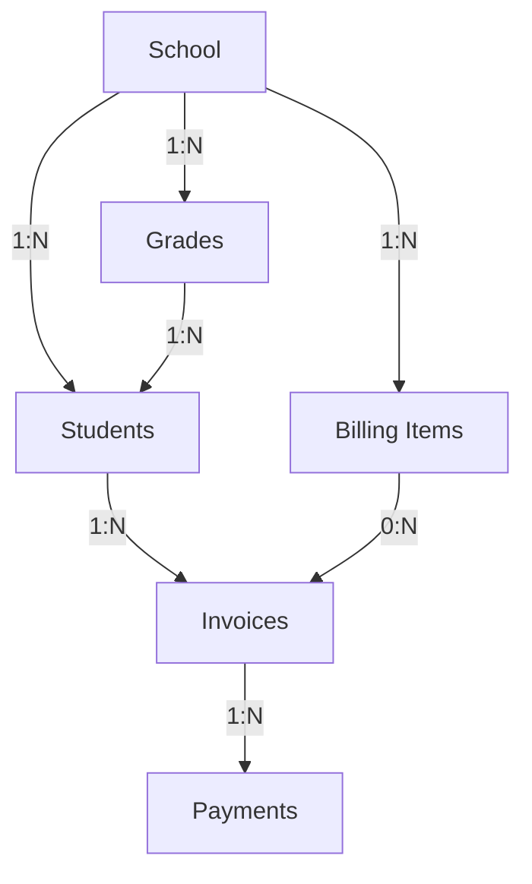
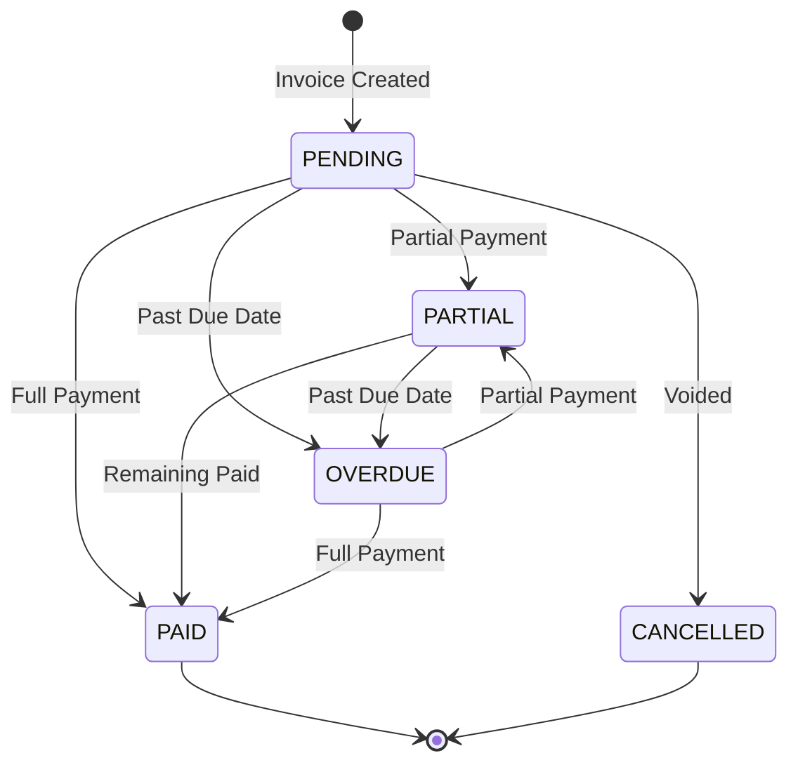

# Database Design - Mattilda Backend

This document describes the database schema design, entity relationships, and design decisions for the Mattilda school billing management system.

## Overview

The database uses **PostgreSQL 15** with **SQLAlchemy 2.0 (async)** as the ORM. The schema follows normalized database design principles (3NF) while optimizing for the specific query patterns required by the application.

## Entity Relationship Diagram (ERD)

### Mermaid Diagram



### ASCII Diagram

```
┌─────────────────────────────────────────────────────────────────────────────────────────┐
│                           MATTILDA DATABASE SCHEMA                                       │
├─────────────────────────────────────────────────────────────────────────────────────────┤
│                                                                                          │
│  ┌─────────────────┐                                                                    │
│  │     SCHOOLS     │                                                                    │
│  ├─────────────────┤                                                                    │
│  │ PK id (UUID)    │──────────────┬──────────────┬──────────────┐                      │
│  │    name         │              │              │              │                      │
│  │    address      │              │              │              │                      │
│  │    phone        │              │              │              │                      │
│  │    email        │              │              │              │                      │
│  │    is_active    │              │              │              │                      │
│  │    created_at   │              │              │              │                      │
│  │    updated_at   │              │ 1:N          │ 1:N          │ 1:N                  │
│  └─────────────────┘              │              │              │                      │
│                                   ▼              ▼              ▼                      │
│                          ┌──────────────┐ ┌─────────────┐ ┌──────────────────┐         │
│                          │    GRADES    │ │  STUDENTS   │ │  BILLING_ITEMS   │         │
│                          ├──────────────┤ ├─────────────┤ ├──────────────────┤         │
│                          │ PK id        │ │ PK id       │ │ PK id            │         │
│                          │ FK school_id │ │ FK school_id│ │ FK school_id     │         │
│                          │    name      │ │ FK grade_id │ │    name          │         │
│                          │    monthly_  │ │    first_   │ │    description   │         │
│                          │    fee       │ │    name     │ │    amount        │         │
│                          │    is_active │ │    last_name│ │    is_recurring  │         │
│                          └──────┬───────┘ │    email    │ │    academic_year │         │
│                                 │         │    enrolled │ │    is_active     │         │
│                                 │ 1:N     │    is_active│ └────────┬─────────┘         │
│                                 └────────►│             │          │                   │
│                                           └──────┬──────┘          │                   │
│                                                  │                 │                   │
│                                                  │ 1:N             │ 0:N               │
│                                                  ▼                 │                   │
│                                           ┌─────────────┐          │                   │
│                                           │  INVOICES   │◄─────────┘                   │
│                                           ├─────────────┤                              │
│                                           │ PK id       │                              │
│                                           │ FK student_ │                              │
│                                           │    id       │                              │
│                                           │ FK billing_ │                              │
│                                           │    item_id  │                              │
│                                           │ invoice_type│                              │
│                                           │    amount   │                              │
│                                           │    due_date │                              │
│                                           │    status   │                              │
│                                           │ description │                              │
│                                           └──────┬──────┘                              │
│                                                  │                                     │
│  ┌─────────────────┐                             │ 1:N                                 │
│  │     USERS       │                             ▼                                     │
│  ├─────────────────┤                      ┌─────────────┐                              │
│  │ PK id (UUID)    │                      │  PAYMENTS   │                              │
│  │    username     │                      ├─────────────┤                              │
│  │    email        │                      │ PK id       │                              │
│  │    hashed_pwd   │                      │ FK invoice_ │                              │
│  │    is_active    │                      │    id       │                              │
│  │    created_at   │                      │    amount   │                              │
│  └─────────────────┘                      │ payment_date│                              │
│                                           │    method   │                              │
│                                           │  reference  │                              │
│                                           │  created_at │                              │
│                                           └─────────────┘                              │
│                                                                                          │
└─────────────────────────────────────────────────────────────────────────────────────────┘
```

## Tables

### 1. schools

Represents educational institutions.

| Column | Type | Constraints | Description |
|--------|------|-------------|-------------|
| `id` | UUID | PK, DEFAULT uuid_generate_v4() | Unique identifier |
| `name` | VARCHAR(255) | NOT NULL | School name |
| `address` | VARCHAR(500) | NULL | Physical address |
| `phone` | VARCHAR(50) | NULL | Contact phone |
| `email` | VARCHAR(255) | NULL | Contact email |
| `is_active` | BOOLEAN | DEFAULT TRUE | Soft delete flag |
| `created_at` | TIMESTAMPTZ | DEFAULT NOW() | Creation timestamp |
| `updated_at` | TIMESTAMPTZ | DEFAULT NOW() | Last update timestamp |

**Indexes:**
- `schools_pkey` (PRIMARY KEY) on `id`
- `ix_schools_is_active` on `is_active`
- `ix_schools_name` on `name`

---

### 2. grades

Represents grade levels within a school with associated tuition fees.

| Column | Type | Constraints | Description |
|--------|------|-------------|-------------|
| `id` | UUID | PK, DEFAULT uuid_generate_v4() | Unique identifier |
| `school_id` | UUID | FK → schools.id, NOT NULL | Parent school |
| `name` | VARCHAR(100) | NOT NULL | Grade name (e.g., "5th Grade") |
| `monthly_fee` | NUMERIC(12,2) | NOT NULL | Monthly tuition fee |
| `is_active` | BOOLEAN | DEFAULT TRUE | Soft delete flag |
| `created_at` | TIMESTAMPTZ | DEFAULT NOW() | Creation timestamp |
| `updated_at` | TIMESTAMPTZ | DEFAULT NOW() | Last update timestamp |

**Indexes:**
- `grades_pkey` (PRIMARY KEY) on `id`
- `ix_grades_school_id` on `school_id`
- `ix_grades_is_active` on `is_active`

**Foreign Keys:**
- `school_id` → `schools.id` (ON DELETE RESTRICT)

---

### 3. billing_items

Represents configurable billing items (enrollment fees, services, etc.).

| Column | Type | Constraints | Description |
|--------|------|-------------|-------------|
| `id` | UUID | PK, DEFAULT uuid_generate_v4() | Unique identifier |
| `school_id` | UUID | FK → schools.id, NOT NULL | Parent school |
| `name` | VARCHAR(200) | NOT NULL | Item name |
| `description` | TEXT | NULL | Detailed description |
| `amount` | NUMERIC(12,2) | NOT NULL | Default amount |
| `is_recurring` | BOOLEAN | DEFAULT FALSE | Monthly recurring charge |
| `academic_year` | VARCHAR(20) | NULL | Academic year (e.g., "2024-2025") |
| `is_active` | BOOLEAN | DEFAULT TRUE | Soft delete flag |
| `created_at` | TIMESTAMPTZ | DEFAULT NOW() | Creation timestamp |
| `updated_at` | TIMESTAMPTZ | DEFAULT NOW() | Last update timestamp |

**Indexes:**
- `billing_items_pkey` (PRIMARY KEY) on `id`
- `ix_billing_items_school_id` on `school_id`
- `ix_billing_items_is_active` on `is_active`

**Foreign Keys:**
- `school_id` → `schools.id` (ON DELETE RESTRICT)

---

### 4. students

Represents students enrolled in schools.

| Column | Type | Constraints | Description |
|--------|------|-------------|-------------|
| `id` | UUID | PK, DEFAULT uuid_generate_v4() | Unique identifier |
| `school_id` | UUID | FK → schools.id, NOT NULL | Parent school |
| `grade_id` | UUID | FK → grades.id, NULL | Current grade/level |
| `first_name` | VARCHAR(100) | NOT NULL | First name |
| `last_name` | VARCHAR(100) | NOT NULL | Last name |
| `email` | VARCHAR(255) | NULL | Contact email |
| `grade` | VARCHAR(50) | NULL | [DEPRECATED] Legacy grade text |
| `enrolled_at` | DATE | DEFAULT CURRENT_DATE | Enrollment date |
| `is_active` | BOOLEAN | DEFAULT TRUE | Soft delete flag |
| `created_at` | TIMESTAMPTZ | DEFAULT NOW() | Creation timestamp |
| `updated_at` | TIMESTAMPTZ | DEFAULT NOW() | Last update timestamp |

**Indexes:**
- `students_pkey` (PRIMARY KEY) on `id`
- `ix_students_school_id` on `school_id`
- `ix_students_grade_id` on `grade_id`
- `ix_students_is_active` on `is_active`
- `ix_students_school_active` on `(school_id, is_active)` - Composite for filtered queries

**Foreign Keys:**
- `school_id` → `schools.id` (ON DELETE RESTRICT)
- `grade_id` → `grades.id` (ON DELETE SET NULL)

---

### 5. invoices

Represents billing documents for students.

| Column | Type | Constraints | Description |
|--------|------|-------------|-------------|
| `id` | UUID | PK, DEFAULT uuid_generate_v4() | Unique identifier |
| `student_id` | UUID | FK → students.id, NOT NULL | Billed student |
| `billing_item_id` | UUID | FK → billing_items.id, NULL | Related billing item |
| `invoice_type` | VARCHAR(20) | NOT NULL | Type: TUITION, ENROLLMENT, FEE, CUSTOM |
| `amount` | NUMERIC(12,2) | NOT NULL | Invoice amount |
| `due_date` | DATE | NOT NULL | Payment due date |
| `status` | VARCHAR(20) | DEFAULT 'PENDING' | Invoice status |
| `description` | TEXT | NULL | Charge description |
| `created_at` | TIMESTAMPTZ | DEFAULT NOW() | Creation timestamp |
| `updated_at` | TIMESTAMPTZ | DEFAULT NOW() | Last update timestamp |

**Indexes:**
- `invoices_pkey` (PRIMARY KEY) on `id`
- `ix_invoices_student_id` on `student_id`
- `ix_invoices_status` on `status`
- `ix_invoices_due_date` on `due_date`
- `ix_invoices_invoice_type` on `invoice_type`
- `ix_invoices_student_status` on `(student_id, status)` - Composite for filtered queries

**Foreign Keys:**
- `student_id` → `students.id` (ON DELETE RESTRICT)
- `billing_item_id` → `billing_items.id` (ON DELETE SET NULL)

**Status Values:**
- `PENDING` - No payments made
- `PARTIAL` - Partially paid
- `PAID` - Fully paid
- `OVERDUE` - Past due date, not fully paid
- `CANCELLED` - Invoice voided

**Invoice Types:**
- `TUITION` - Monthly tuition fee
- `ENROLLMENT` - Enrollment/registration fee
- `FEE` - Additional fee (from billing_items)
- `CUSTOM` - Custom/manual invoice

---

### 6. payments

Represents payment transactions against invoices.

| Column | Type | Constraints | Description |
|--------|------|-------------|-------------|
| `id` | UUID | PK, DEFAULT uuid_generate_v4() | Unique identifier |
| `invoice_id` | UUID | FK → invoices.id, NOT NULL | Paid invoice |
| `amount` | NUMERIC(12,2) | NOT NULL | Payment amount |
| `payment_date` | DATE | DEFAULT CURRENT_DATE | Payment date |
| `method` | VARCHAR(20) | DEFAULT 'CASH' | Payment method |
| `reference` | VARCHAR(255) | NULL | External reference |
| `created_at` | TIMESTAMPTZ | DEFAULT NOW() | Creation timestamp |

**Indexes:**
- `payments_pkey` (PRIMARY KEY) on `id`
- `ix_payments_invoice_id` on `invoice_id`
- `ix_payments_payment_date` on `payment_date`
- `ix_payments_method` on `method`

**Foreign Keys:**
- `invoice_id` → `invoices.id` (ON DELETE RESTRICT)

**Payment Methods:**
- `CASH`
- `BANK_TRANSFER`
- `CREDIT_CARD`
- `DEBIT_CARD`
- `OTHER`

---

### 7. users

Represents API users for authentication.

| Column | Type | Constraints | Description |
|--------|------|-------------|-------------|
| `id` | UUID | PK, DEFAULT uuid_generate_v4() | Unique identifier |
| `username` | VARCHAR(100) | UNIQUE, NOT NULL | Login username |
| `email` | VARCHAR(255) | UNIQUE, NOT NULL | Email address |
| `hashed_password` | VARCHAR(255) | NOT NULL | Bcrypt hash |
| `is_active` | BOOLEAN | DEFAULT TRUE | Account active |
| `created_at` | TIMESTAMPTZ | DEFAULT NOW() | Creation timestamp |

**Indexes:**
- `users_pkey` (PRIMARY KEY) on `id`
- `ix_users_username` (UNIQUE) on `username`
- `ix_users_email` (UNIQUE) on `email`

---

## Relationships



### School → Grades (One-to-Many)
- One school can have many grades
- Each grade belongs to exactly one school
- Grades define monthly tuition fees

### School → Students (One-to-Many)
- One school can have many students
- A student belongs to exactly one school
- Deleting a school is restricted if students exist

### Grade → Students (One-to-Many)
- One grade can have many students
- A student can optionally belong to a grade
- Used to determine monthly tuition amount

### School → Billing Items (One-to-Many)
- One school can have many billing items
- Billing items are school-specific charges

### Student → Invoices (One-to-Many)
- One student can have many invoices
- An invoice belongs to exactly one student
- Deleting a student is restricted if invoices exist

### Billing Item → Invoices (One-to-Many, Optional)
- An invoice can optionally reference a billing item
- Used for FEE and ENROLLMENT type invoices

### Invoice → Payments (One-to-Many)
- One invoice can have many payments (partial payments)
- A payment belongs to exactly one invoice
- Deleting an invoice is restricted if payments exist

---

## Data Flow

### Invoice Payment Flow



### Statement Calculation Flow

```
School Statement                          Student Statement
      │                                         │
      ▼                                         ▼
┌─────────────────┐                    ┌─────────────────┐
│ Get all students│                    │ Get all invoices│
│ for school      │                    │ for student     │
└────────┬────────┘                    └────────┬────────┘
         │                                      │
         ▼                                      ▼
┌─────────────────┐                    ┌─────────────────┐
│ For each student│                    │ For each invoice│
│ get invoices    │                    │ get payments    │
└────────┬────────┘                    └────────┬────────┘
         │                                      │
         ▼                                      ▼
┌─────────────────┐                    ┌─────────────────┐
│ Calculate:      │                    │ Calculate:      │
│ - total_invoiced│                    │ - paid_amount   │
│ - total_paid    │                    │ - pending_amount│
│ - total_pending │                    └────────┬────────┘
│ - total_overdue │                             │
└────────┬────────┘                             ▼
         │                             ┌─────────────────┐
         ▼                             │ Aggregate:      │
┌─────────────────┐                    │ - total_invoiced│
│ Return statement│                    │ - total_paid    │
│ with summary    │                    │ - total_pending │
└─────────────────┘                    │ - total_overdue │
                                       └─────────────────┘
```

---

## Design Decisions

### 1. UUID Primary Keys

**Why:** UUIDs provide several advantages over auto-increment integers:
- No sequential guessing (security)
- Client-side ID generation possible
- Better for distributed systems
- No conflicts when merging databases

**Trade-off:** Slightly larger storage and index size (16 bytes vs 4-8 bytes)

### 2. Soft Deletes (is_active flag)

**Why:** Instead of hard deleting records:
- Maintains audit trail
- Prevents orphaned references
- Allows data recovery
- Historical reporting remains accurate

**Implementation:** All queries filter by `is_active = TRUE` by default

### 3. Numeric(12,2) for Money

**Why:** Using NUMERIC/DECIMAL instead of FLOAT:
- Exact decimal representation
- No floating-point rounding errors
- Standard for financial applications
- Range: up to $9,999,999,999.99

### 4. Timestamp with Time Zone

**Why:** Using TIMESTAMPTZ for all timestamps:
- Stores in UTC internally
- Converts automatically based on client timezone
- Prevents timezone confusion
- Best practice for distributed systems

### 5. Computed Properties in ORM

**Why:** `paid_amount` and `pending_amount` as properties:
- Always accurate (calculated from payments)
- No data duplication
- No sync issues
- Can be optimized to SQL if needed

### 6. Immutable Payments

**Why:** Payments have no `updated_at` and cannot be modified:
- Financial audit requirements
- Prevents accidental modifications
- Corrections require new adjustment entries
- Simpler data integrity

### 7. Composite Indexes

**Why:** Created composite indexes for common query patterns:
- `(school_id, is_active)` - Get active students per school
- `(student_id, status)` - Get invoices by status per student

### 8. Grade as Separate Entity

**Why:** Grades are a separate table instead of a string field:
- Defines monthly tuition fee per grade
- Enforces consistency across students
- Allows grade-specific billing
- Easy to update fees for all students in a grade

---

## Migrations

Migrations are managed with **Alembic** and stored in `alembic/versions/`.

### Current Migrations

1. `001_initial_migration.py` - Creates schools, students, invoices, payments tables
2. `002_add_users_table.py` - Adds users table for authentication
3. `003_add_report_views.py` - Creates database views for reporting
4. `1c309ae71d2f_add_grades_and_billing_items.py` - Adds grades and billing_items tables
5. `004_update_report_views.py` - Updates views to use grades table

### Migration Commands

```bash
# Create a new migration
alembic revision --autogenerate -m "description"

# Apply all pending migrations
alembic upgrade head

# Rollback one migration
alembic downgrade -1

# View migration history
alembic history

# View current revision
alembic current
```

---

## Database Views

The database includes pre-built views for common reporting queries. These views are exposed through the `/api/v1/reports/*` endpoints.

### v_student_balance

**Purpose:** Current financial balance for each student.

```sql
SELECT
    student_id, first_name, last_name, full_name, email,
    COALESCE(g.name, est.grade) AS grade,  -- From grades table or legacy
    g.monthly_fee,
    is_active, school_id, school_name,
    total_invoices, total_invoiced, total_paid, balance_due,
    overdue_invoices, pending_invoices, partial_invoices, paid_invoices
FROM students
LEFT JOIN grades ON grades.id = students.grade_id
...
```

**API Endpoint:** `GET /api/v1/reports/students/balance`

---

### v_school_summary

**Purpose:** Financial summary aggregated by school.

| Column | Description |
|--------|-------------|
| school_id | School UUID |
| school_name | School name |
| total_students | Total enrolled students |
| active_students | Currently active students |
| total_invoiced | Sum of all invoices |
| total_collected | Sum of all payments |
| total_pending | Outstanding balance |
| total_overdue | Amount past due date |

**API Endpoint:** `GET /api/v1/reports/schools/summary`

---

### v_invoice_details

**Purpose:** Complete invoice information with payment status.

**API Endpoint:** `GET /api/v1/reports/invoices/details`

---

### v_payment_history

**Purpose:** Complete payment history with all related details.

**API Endpoint:** `GET /api/v1/reports/payments/history`

---

### v_overdue_invoices

**Purpose:** All overdue invoices for collections follow-up.

**API Endpoint:** `GET /api/v1/reports/invoices/overdue`

---

### v_daily_collections

**Purpose:** Daily payment totals grouped by school and payment method.

**API Endpoint:** `GET /api/v1/reports/collections/daily`

---

### v_monthly_revenue

**Purpose:** Monthly revenue statistics by school.

**API Endpoint:** `GET /api/v1/reports/revenue/monthly`

---

## Query Examples

### Get School with Student Count and Financial Summary

```sql
SELECT
    s.id,
    s.name,
    COUNT(DISTINCT st.id) FILTER (WHERE st.is_active) as active_students,
    COUNT(DISTINCT st.id) as total_students,
    COALESCE(SUM(i.amount), 0) as total_invoiced,
    COALESCE(SUM(p.amount), 0) as total_paid
FROM schools s
LEFT JOIN students st ON st.school_id = s.id
LEFT JOIN invoices i ON i.student_id = st.id AND i.status != 'CANCELLED'
LEFT JOIN payments p ON p.invoice_id = i.id
WHERE s.id = :school_id
GROUP BY s.id, s.name;
```

### Get Students by Grade with Monthly Fee

```sql
SELECT
    st.id,
    st.first_name || ' ' || st.last_name as full_name,
    g.name as grade_name,
    g.monthly_fee
FROM students st
JOIN grades g ON g.id = st.grade_id
WHERE st.school_id = :school_id
  AND st.is_active = TRUE
ORDER BY g.name, st.last_name;
```

### Get Overdue Invoices

```sql
SELECT
    i.*,
    st.first_name || ' ' || st.last_name as student_name,
    i.amount - COALESCE(SUM(p.amount), 0) as pending_amount
FROM invoices i
JOIN students st ON st.id = i.student_id
LEFT JOIN payments p ON p.invoice_id = i.id
WHERE i.due_date < CURRENT_DATE
  AND i.status NOT IN ('PAID', 'CANCELLED')
GROUP BY i.id, st.first_name, st.last_name
HAVING i.amount > COALESCE(SUM(p.amount), 0);
```

---

## Performance Considerations

### Indexes Strategy

1. **Foreign Keys**: All FK columns are indexed for JOIN performance
2. **Status Filters**: Index on status for common WHERE clauses
3. **Date Ranges**: Index on due_date and payment_date for date queries
4. **Composite**: Combined indexes for frequent multi-column filters

### Eager Loading

The ORM uses `selectinload` strategy for relationships:
- Executes separate SELECT queries per relationship
- Avoids N+1 query problem
- Better for varying result set sizes

### Caching

Redis cache is implemented for:
- School details (TTL: 5 minutes)
- Student details (TTL: 5 minutes)
- Invoice lists (TTL: 2 minutes)

Cache is invalidated on writes.

---

## Security

### Data Protection

1. **Passwords**: Stored as bcrypt hashes (cost factor: default)
2. **UUIDs**: Prevent enumeration attacks
3. **Soft Deletes**: Maintain audit trail
4. **Timestamps**: Track all changes

### Access Control

- JWT authentication required for all endpoints
- Token expiration configurable (default: 30 minutes)
- User status checked on each request

---

## Future Considerations

If extending this schema, consider:

1. **Multi-tenancy**: Add `tenant_id` to all tables
2. **Audit Log**: Separate table for all changes
3. **Invoice Items**: Line items for invoices
4. **Payment Adjustments**: Refunds and corrections
5. **School Admins**: Link users to schools with roles
6. **Recurring Invoices**: Schedule automatic invoice generation
7. **Grade Promotions**: Track student grade history
