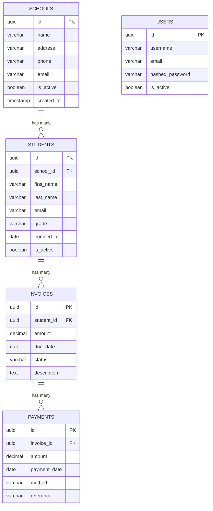
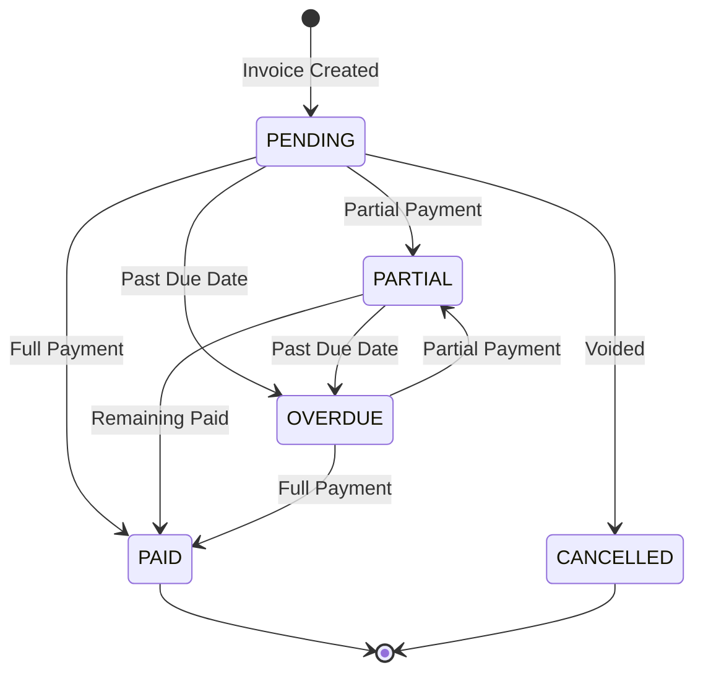

# Mattilda Backend Challenge

Backend system for school billing management built with FastAPI, PostgreSQL, and SQLAlchemy.

**Challenge**: School Billing Management System
**Candidate**: Jonathan Avila - Senior Backend Engineer
**Duration**: 48 hours

## Tech Stack

| Category | Technology |
|----------|------------|
| Language | Python 3.11+ |
| Framework | FastAPI |
| Database | PostgreSQL 15 |
| ORM | SQLAlchemy 2.0 (async) |
| Migrations | Alembic |
| Cache | Redis 7 |
| Auth | JWT (python-jose + bcrypt) |
| Validation | Pydantic 2.0 |
| Logging | Structlog |
| Testing | Pytest + pytest-asyncio |
| Containerization | Docker + Docker Compose |
| CI/CD | GitHub Actions |

## Architecture

### Domain-Driven Design (DDD)

```
src/
├── domain/                  # Core Business Logic
│   ├── entities/            # Rich domain entities (School, Student, Invoice, Payment)
│   ├── value_objects/       # Immutable value objects (Money, EmailAddress, FullName)
│   ├── interfaces/          # Repository & UnitOfWork protocols
│   ├── enums.py             # InvoiceStatus, PaymentMethod
│   └── exceptions.py       # Domain exceptions
├── application/             # Use Cases
│   ├── services/            # Application services (orchestration)
│   └── dto/                 # Data transfer objects
├── infrastructure/          # External Concerns
│   └── database/
│       ├── models.py        # SQLAlchemy ORM models
│       ├── connection.py    # Async session factory
│       ├── unit_of_work.py  # UoW implementation
│       └── repositories/    # Repository implementations
└── api/                     # Presentation Layer
    ├── auth/                # JWT authentication
    ├── routes/              # FastAPI route handlers
    ├── schemas/             # Pydantic request/response models
    └── dependencies.py      # Dependency injection
```

### Key DDD Patterns

| Pattern | Implementation |
|---------|---------------|
| **Rich Entities** | Invoice aggregate root with `record_payment()`, `cancel()`, `mark_overdue()` |
| **Value Objects** | `Money` (immutable decimal), `EmailAddress`, `FullName` |
| **Aggregate Root** | Invoice owns Payments, enforces business invariants |
| **Repository Protocol** | Python `Protocol` interfaces in domain layer |
| **Unit of Work** | Transaction management across repositories |

## Database Design

### Entity Relationship Diagram


```mermaid
erDiagram
    SCHOOLS ||--o{ STUDENTS : "has many"
    STUDENTS ||--o{ INVOICES : "has many"
    INVOICES ||--o{ PAYMENTS : "has many"

    SCHOOLS {
        uuid id PK
        varchar name
        varchar address
        varchar phone
        varchar email
        boolean is_active
        timestamp created_at
    }

    STUDENTS {
        uuid id PK
        uuid school_id FK
        varchar first_name
        varchar last_name
        varchar email
        varchar grade
        date enrolled_at
        boolean is_active
    }

    INVOICES {
        uuid id PK
        uuid student_id FK
        decimal amount
        date due_date
        varchar status
        text description
    }

    PAYMENTS {
        uuid id PK
        uuid invoice_id FK
        decimal amount
        date payment_date
        varchar method
        varchar reference
    }

    USERS {
        uuid id PK
        varchar username
        varchar email
        varchar hashed_password
        boolean is_active
    }
```

### Database Tables

#### schools
| Column | Type | Description |
|--------|------|-------------|
| `id` | UUID | Primary key |
| `name` | VARCHAR(255) | School name |
| `address` | VARCHAR(500) | Physical address |
| `phone` | VARCHAR(50) | Contact phone |
| `email` | VARCHAR(255) | Contact email |
| `is_active` | BOOLEAN | Soft delete flag |
| `created_at` | TIMESTAMPTZ | Creation timestamp |

#### students
| Column | Type | Description |
|--------|------|-------------|
| `id` | UUID | Primary key |
| `school_id` | UUID | FK -> schools.id |
| `first_name` | VARCHAR(100) | First name |
| `last_name` | VARCHAR(100) | Last name |
| `email` | VARCHAR(255) | Contact email |
| `grade` | VARCHAR(50) | Grade/level (e.g., "5th Grade") |
| `enrolled_at` | DATE | Enrollment date |
| `is_active` | BOOLEAN | Soft delete flag |

#### invoices
| Column | Type | Description |
|--------|------|-------------|
| `id` | UUID | Primary key |
| `student_id` | UUID | FK -> students.id |
| `amount` | NUMERIC(12,2) | Invoice amount |
| `due_date` | DATE | Payment due date |
| `status` | VARCHAR(20) | PENDING, PARTIAL, PAID, OVERDUE, CANCELLED |
| `description` | TEXT | Charge description |

#### payments
| Column | Type | Description |
|--------|------|-------------|
| `id` | UUID | Primary key |
| `invoice_id` | UUID | FK -> invoices.id |
| `amount` | NUMERIC(12,2) | Payment amount |
| `payment_date` | DATE | Payment date |
| `method` | VARCHAR(20) | CASH, BANK_TRANSFER, CREDIT_CARD, DEBIT_CARD, OTHER |
| `reference` | VARCHAR(255) | External reference |

### Invoice Status Flow


```mermaid
stateDiagram-v2
    [*] --> PENDING: Invoice Created
    PENDING --> PARTIAL: Partial Payment
    PENDING --> PAID: Full Payment
    PENDING --> OVERDUE: Past Due Date
    PENDING --> CANCELLED: Voided
    PARTIAL --> PAID: Remaining Paid
    PARTIAL --> OVERDUE: Past Due Date
    OVERDUE --> PARTIAL: Partial Payment
    OVERDUE --> PAID: Full Payment
    PAID --> [*]
    CANCELLED --> [*]
```

### Database Views (Reports)

Pre-built views for reporting, exposed via `/api/v1/reports/*`:

| View | Endpoint | Description |
|------|----------|-------------|
| `v_student_balance` | `/reports/students/balance` | Current financial balance per student |
| `v_school_summary` | `/reports/schools/summary` | Financial summary by school |
| `v_invoice_details` | `/reports/invoices/details` | Complete invoice information |
| `v_payment_history` | `/reports/payments/history` | Payment history with details |
| `v_overdue_invoices` | `/reports/invoices/overdue` | Overdue invoices for collections |
| `v_daily_collections` | `/reports/collections/daily` | Daily payments by school |
| `v_monthly_revenue` | `/reports/revenue/monthly` | Monthly revenue statistics |

### Design Decisions

| Decision | Rationale |
|----------|-----------|
| **UUID Primary Keys** | Security (no sequential guessing), distributed systems ready |
| **Soft Deletes** | Audit trail, data recovery, referential integrity |
| **NUMERIC(12,2)** | Exact decimal for money (no float errors), up to $9.99B |
| **TIMESTAMPTZ** | UTC storage with automatic timezone conversion |
| **Immutable Payments** | Financial audit compliance, no accidental modifications |
| **Invoice as Aggregate** | All payment logic enforced through the Invoice entity |

### Migrations

Migrations are managed with Alembic in `alembic/versions/`:

1. `001_initial_migration.py` - Creates schools, students, invoices, payments
2. `002_add_users_table.py` - Adds users table for authentication
3. `003_add_report_views.py` - Creates database views for reporting
4. `1c309ae71d2f_add_grades_and_billing_items.py` - Added grades and billing_items (historical)
5. `004_update_report_views.py` - Updated views for grades (historical)
6. `005_remove_grades_billing_items.py` - Removes grades/billing_items, simplifies schema

## Quick Start

### Prerequisites

- Docker and Docker Compose installed
- Git

### Setup

1. **Clone the repository**:
```bash
git clone <repository-url>
cd mattilda-backend
```

2. **Copy environment file**:
```bash
cp .env.example .env
```

3. **Start all services**:
```bash
docker-compose up -d
```

4. **Run database migrations**:
```bash
docker-compose exec api alembic upgrade head
```

5. **Access the API documentation**:
   - Swagger UI: http://localhost:8000/docs
   - ReDoc: http://localhost:8000/redoc
   - Health Check: http://localhost:8000/health

### Load Sample Data (Optional)

```bash
docker-compose exec api python scripts/seed_data.py
```

## API Endpoints

### Authentication
| Method | Endpoint | Description |
|--------|----------|-------------|
| POST | `/api/v1/auth/register` | Register new user |
| POST | `/api/v1/auth/login` | Login and get JWT token |
| GET | `/api/v1/auth/me` | Get current user info |

### Schools
| Method | Endpoint | Description |
|--------|----------|-------------|
| GET | `/api/v1/schools` | List all schools (paginated) |
| GET | `/api/v1/schools/{id}` | Get school by ID |
| POST | `/api/v1/schools` | Create new school |
| PUT | `/api/v1/schools/{id}` | Update school |
| DELETE | `/api/v1/schools/{id}` | Soft delete school |
| GET | `/api/v1/schools/{id}/statement` | **Account statement** |
| GET | `/api/v1/schools/{id}/students` | List school's students |

### Students
| Method | Endpoint | Description |
|--------|----------|-------------|
| GET | `/api/v1/students` | List all students (paginated) |
| GET | `/api/v1/students/{id}` | Get student by ID |
| POST | `/api/v1/students` | Create new student |
| PUT | `/api/v1/students/{id}` | Update student |
| DELETE | `/api/v1/students/{id}` | Soft delete student |
| GET | `/api/v1/students/{id}/statement` | **Account statement** |
| GET | `/api/v1/students/{id}/invoices` | List student's invoices |

### Invoices
| Method | Endpoint | Description |
|--------|----------|-------------|
| GET | `/api/v1/invoices` | List all invoices (paginated, filterable) |
| GET | `/api/v1/invoices/{id}` | Get invoice by ID |
| POST | `/api/v1/invoices` | Create new invoice |
| PUT | `/api/v1/invoices/{id}` | Update invoice |
| DELETE | `/api/v1/invoices/{id}` | Cancel invoice |

### Payments
| Method | Endpoint | Description |
|--------|----------|-------------|
| GET | `/api/v1/payments` | List all payments |
| POST | `/api/v1/payments` | Register payment |
| GET | `/api/v1/payments/invoice/{id}` | Payments for invoice |

### Reports (Database Views)
| Method | Endpoint | Description |
|--------|----------|-------------|
| GET | `/api/v1/reports/students/balance` | Student balances with debt |
| GET | `/api/v1/reports/schools/summary` | School financial summary |
| GET | `/api/v1/reports/invoices/details` | Detailed invoice info |
| GET | `/api/v1/reports/invoices/overdue` | Overdue invoices for collections |
| GET | `/api/v1/reports/payments/history` | Complete payment history |
| GET | `/api/v1/reports/collections/daily` | Daily collections by school |
| GET | `/api/v1/reports/revenue/monthly` | Monthly revenue statistics |

## Key Business Features

### 1. Student Debt Tracking
Calculate how much a student owes to a school.

### 2. School-wide Debt Summary
Total pending payments across all students.

### 3. Student Count
Number of students per school (active and total).

### 4. Account Statements
Detailed financial reports for schools and students.

### 5. Payment Validation
- Prevents overpayments (payment > pending amount)
- Blocks payments to cancelled invoices
- Auto-updates invoice status (PENDING -> PARTIAL -> PAID)
- Business logic enforced in the Invoice aggregate root

## Domain Model

### Invoice (Aggregate Root)

The Invoice entity is the core aggregate root, encapsulating all payment-related business rules:

```python
invoice.record_payment(amount, method, reference)  # Records payment, updates status
invoice.cancel()                                     # Cancels if no payments exist
invoice.mark_overdue()                               # Marks as overdue if past due date
invoice.paid_amount                                  # Sum of all payments
invoice.pending_amount                               # Remaining balance
```

### Value Objects

```python
Money(500.00)           # Immutable, validated, supports arithmetic
EmailAddress("a@b.com") # Validated email format
FullName("John", "Doe") # Validated name parts
```

## Bonus Features Implemented

| Feature | Description |
|---------|-------------|
| Redis Cache | Configurable caching for read endpoints |
| JWT Authentication | Secure API access with token-based auth |
| Structured Logging | JSON logs with structlog for observability |
| Health Check | `/health` endpoint for container orchestration |
| Pagination | All list endpoints support pagination |
| Soft Deletes | Entities are deactivated, not deleted |
| CI/CD Pipeline | GitHub Actions with tests and coverage |
| DDD Patterns | Rich entities, value objects, aggregate roots, UoW |

## Development

### Running Tests

```bash
# Run all tests
docker-compose exec api pytest

# Run with verbose output
docker-compose exec api pytest -v

# Run specific test file
docker-compose exec api pytest tests/unit/test_invoice_service.py
```

### Running with Coverage

```bash
docker-compose exec api pytest --cov=src --cov-report=html --cov-report=term
```

### Database Operations

```bash
# Apply all migrations
docker-compose exec api alembic upgrade head

# Rollback one migration
docker-compose exec api alembic downgrade -1

# View migration history
docker-compose exec api alembic history
```

### View Logs

```bash
docker-compose logs -f api
```

## Environment Variables

| Variable | Description | Default |
|----------|-------------|---------|
| `DATABASE_URL` | PostgreSQL connection string | postgresql+asyncpg://... |
| `REDIS_URL` | Redis connection string | redis://redis:6379/0 |
| `SECRET_KEY` | JWT secret key | (change in production!) |
| `DEBUG` | Enable debug mode | true |
| `CACHE_TTL` | Cache TTL in seconds | 300 |
| `ACCESS_TOKEN_EXPIRE_MINUTES` | JWT expiration | 30 |

## Docker Services

| Service | Port | Description |
|---------|------|-------------|
| api | 8000 | FastAPI application |
| db | 5432 | PostgreSQL database |
| redis | 6379 | Redis cache |
| pgadmin | 5050 | Database admin UI |

## Troubleshooting

### Reset everything

```bash
docker-compose down -v
docker-compose up -d --build
docker-compose exec api alembic upgrade head
```

## License

MIT

---

**Built with** FastAPI, PostgreSQL, Redis, Docker
**Challenge completed by**: Jonathan Avila
